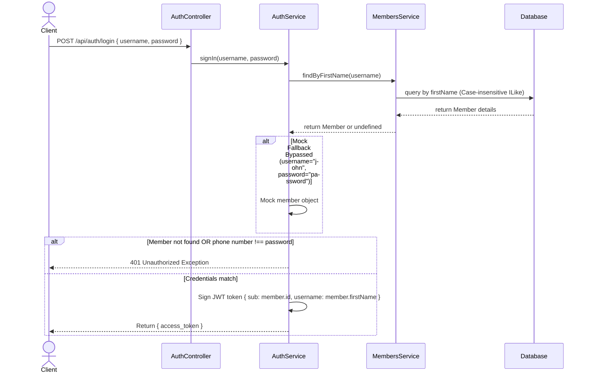
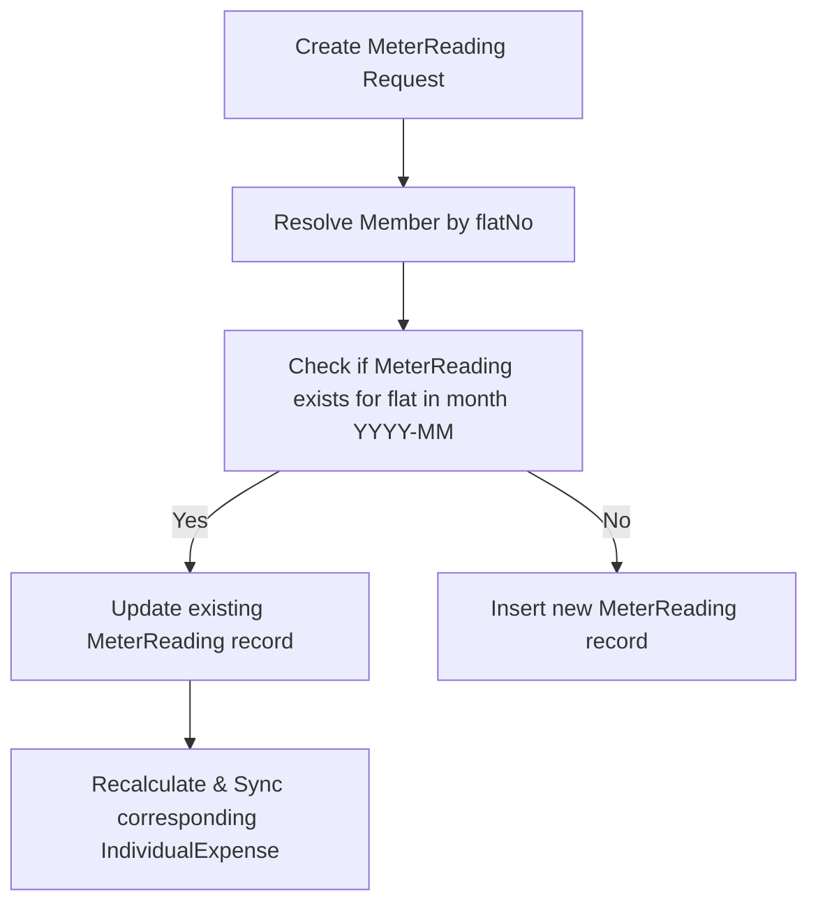

# System Flow & API Routes Documentation

This document provides a comprehensive overview of the system design, flow architectures, and all available API routes (including methods, paths, payloads, and response shapes).

---

## 1. System Architectures & Flows

### Authentication Flow
Authenticates user login inputs against the database `Member` records.


### Dynamic Individual Expense Calculation Flow
When retrieving individual expenses, the system dynamically calculates the values on the fly from the meter readings of all active flats.
```mermaid
graph TD
    A[Find All Request] --> B[Resolve Active Members]
    B --> C[Resolve MeterReadings for selected month]
    C --> D[Compute Flat Consumption: currentReading - previousReading]
    D --> E[Query monthly Expense Overview: oneLiterCharge]
    E --> F[Calculate waterExpense: consumption * oneLiterCharge]
    F --> G[Query General Expenses: totalOtherExpenses]
    G --> H[Calculate otherExpenseShare: totalOtherExpenses / count(activeMembers)]
    H --> I[Round otherExpenseShare and totalExpense: Math.round]
    I --> J[Batch-query Collections & DB Expenses]
    J --> K[Calculate totalCollected & availableBalance all-time]
    K --> L[Return computed array synchronously]
```

### Meter Reading Constraint Check & Auto-Update Flow
When creating a meter reading, if a reading already exists for the flat in the target month, the system automatically updates the existing record instead of inserting a duplicate.



---

## 2. API Routes Reference

All endpoint base URLs are prefixed with `/api`. Protected routes require the header `Authorization: Bearer <access_token>`.

---

### A. Authentication Module

#### 1. Login Authentication
* **HTTP Method**: `POST`
* **URL**: `/api/auth/login`
* **Authorization**: None
* **Request Payload**:
  ```json
  {
    "username": "john",
    "password": "password"
  }
  ```
* **Response Payload**:
  ```json
  {
    "access_token": "eyJhbGciOiJIUzI1NiIsInR5cCI6IkpXVCJ9..."
  }
  ```

#### 2. Get Authenticated User Profile
* **HTTP Method**: `GET`
* **URL**: `/api/auth/profile`
* **Authorization**: Required (JWT Bearer Token)
* **Response Payload**:
  ```json
  {
    "sub": "mock-john-uuid",
    "username": "john",
    "iat": 1718104523,
    "exp": 1718110523
  }
  ```

---

### B. Expenses Module

#### 1. Create Expense
* **HTTP Method**: `POST`
* **URL**: `/api/expenses`
* **Authorization**: Required (JWT Bearer Token)
* **Request Payload**:
  ```json
  {
    "type": "water", // Options: 'water', 'electricity maintenance', 'electricity bill', 'watchmen salary', 'lift maintenance and parts', 'motor maintenance', 'other'
    "waterSource": "tanker", // Required if type="water". Options: 'tanker', 'main water', 'borewell'
    "amount": 2500,
    "date": "2026-06-11",
    "category": "utility", // Optional
    "comments": "Regular monthly water tanker", // Optional
    "attachmentId": "e305e94b-48cd-40a2-9b2f-3d1246ea48d8" // Optional (UUID of uploaded receipt file)
  }
  ```
* **Response Payload**:
  ```json
  {
    "id": "6a9e88bf-9eb8-4223-9e4a-5f50a80e1d51",
    "type": "water",
    "waterSource": "tanker",
    "amount": 2500,
    "date": "2026-06-11T00:00:00.000Z",
    "category": "utility",
    "comments": "Regular monthly water tanker",
    "attachmentId": "e305e94b-48cd-40a2-9b2f-3d1246ea48d8",
    "createdBy": "mock-john-uuid",
    "createdAt": "2026-06-11T16:00:00.000Z",
    "updatedAt": "2026-06-11T16:00:00.000Z"
  }
  ```

#### 2. Get Expense Overview (Calculated Utility Metrics)
* **HTTP Method**: `GET`
* **URL**: `/api/expenses/overview?month=YYYY-MM`  
  *(If query `month` is omitted, defaults to the current month in `YYYY-MM` format)*
* **Authorization**: Required (JWT Bearer Token)
* **Response Payload**:
  ```json
  {
    "selectedMonth": "2026-06",
    "totalMeterReading": 1500.5,
    "totalWaterAmount": 3000,
    "totalOtherExpenseAmount": 1500,
    "oneLiterCharge": 2,
    "totalAllExpense": 4500,
    "totalCollected": 5000,
    "overbal": 500,
    "meta": {
      "expensesCount": 5,
      "meterReadingsCount": 12,
      "collectionsCount": 8
    }
  }
  ```

#### 3. Find All Expenses
* **HTTP Method**: `GET`
* **URL**: `/api/expenses?page=1&limit=10&search=water&sort=createdAt:DESC`
* **Authorization**: None
* **Response Payload**:
  ```json
  {
    "expenses": [
      {
        "id": "6a9e88bf-9eb8-4223-9e4a-5f50a80e1d51",
        "type": "water",
        "amount": 2500,
        "date": "2026-06-11"
      }
    ],
    "total": 1,
    "page": 1,
    "limit": 10,
    "totalAmount": 2500
  }
  ```

#### 4. Find One Expense
* **HTTP Method**: `GET`
* **URL**: `/api/expenses/:id`
* **Authorization**: None
* **Response Payload**: Returns one expense object (same structure as Create response).

#### 5. Update Expense
* **HTTP Method**: `PATCH`
* **URL**: `/api/expenses/:id`
* **Authorization**: Required (JWT Bearer Token)
* **Request Payload**: (All fields optional, same fields as Create Expense DTO)
* **Response Payload**: Returns the updated expense object with the `updatedBy` property populated.

#### 6. Delete Expense
* **HTTP Method**: `DELETE`
* **URL**: `/api/expenses/:id`
* **Authorization**: None
* **Response Payload**:
  ```json
  {
    "deleted": true
  }
  ```

---

### C. Members Module

#### 1. Create Member
* **HTTP Method**: `POST`
* **URL**: `/api/members`
* **Authorization**: Required (JWT Bearer Token)
* **Request Payload**:
  ```json
  {
    "firstName": "John",
    "lastName": "Doe",
    "phoneNumber": "9876543210",
    "flatNo": "102A",
    "active": true, // Optional (defaults to true)
    "description": "Owner of flat 102A" // Optional
  }
  ```
* **Response Payload**: Returns the saved member object (includes `id`, `createdBy`, `createdAt`, `updatedAt`).

#### 2. Find All Members
* **HTTP Method**: `GET`
* **URL**: `/api/members?page=1&limit=10&searchTerm=John&sort=createdAt:DESC`
* **Authorization**: None
* **Response Payload**:
  ```json
  {
    "data": [
      {
        "id": "b3e8c950-8b1e-4c5c-9c3f-4e50d80c1d51",
        "firstName": "John",
        "lastName": "Doe",
        "phoneNumber": "9876543210",
        "flatNo": "102A",
        "active": true,
        "totalCollected": 12000,
        "totalExpense": 9500.5,
        "availableBalance": 2499.5,
        "remainderBalance": 2499.5
      }
    ],
    "total": 1,
    "page": 1,
    "limit": 10
  }
  ```

#### 3. Find One Member
* **HTTP Method**: `GET`
* **URL**: `/api/members/:uuid`
* **Authorization**: None
* **Response Payload**:
  ```json
  {
    "id": "b3e8c950-8b1e-4c5c-9c3f-4e50d80c1d51",
    "firstName": "John",
    "lastName": "Doe",
    "phoneNumber": "9876543210",
    "flatNo": "102A",
    "active": true,
    "totalCollected": 12000,
    "totalExpense": 9500.5,
    "availableBalance": 2499.5,
    "remainderBalance": 2499.5
  }
  ```

#### 4. Update Member
* **HTTP Method**: `PATCH`
* **URL**: `/api/members/:uuid`
* **Authorization**: Required (JWT Bearer Token)
* **Request Payload**: (All fields optional)
* **Response Payload**: Returns the updated member object.

#### 5. Delete Member
* **HTTP Method**: `DELETE`
* **URL**: `/api/members/:uuid`
* **Authorization**: None

---

### D. Meter Readings Module

#### 1. Create Meter Reading
* **HTTP Method**: `POST`
* **URL**: `/api/meter-reading`
* **Authorization**: Required (JWT Bearer Token)
* **Request Payload**:
  ```json
  {
    "flatNo": "102A",
    "currentReading": 520.4,
    "previousReading": 480.2, // Optional
    "readingDate": "2026-06-11", // YYYY-MM-DD
    "notes": "June regular reading" // Optional
  }
  ```
* **Response Payload**: Returns the saved meter reading object (includes `id`, `memberId`, `createdBy`, `createdAt`, `updatedAt`).

#### 2. Find All Meter Readings
* **HTTP Method**: `GET`
* **URL**: `/api/meter-reading?page=1&limit=10`
* **Authorization**: None

#### 3. Find One Meter Reading
* **HTTP Method**: `GET`
* **URL**: `/api/meter-reading/:uuid`
* **Authorization**: None

#### 4. Update Meter Reading
* **HTTP Method**: `PATCH`
* **URL**: `/api/meter-reading/:uuid`
* **Authorization**: Required (JWT Bearer Token)
* **Request Payload**: (All fields optional)

#### 5. Delete Meter Reading
* **HTTP Method**: `DELETE`
* **URL**: `/api/meter-reading/:uuid`
* **Authorization**: None

---

### E. Collection Amount Module

#### 1. Create Collection Amount (Payments Received)
* **HTTP Method**: `POST`
* **URL**: `/api/collection-amount`
* **Authorization**: Required (JWT Bearer Token)
* **Request Payload**:
  ```json
  {
    "flatNo": "102A",
    "amount": 1200,
    "date": "2026-06-11", // YYYY-MM-DD
    "paymentMethod": "UPI", // Optional
    "description": "Maintenance payment June" // Optional
  }
  ```
* **Response Payload**: Returns the saved collection object.

#### 2. Find All Collection Amounts
* **HTTP Method**: `GET`
* **URL**: `/api/collection-amount?page=1&limit=10`
* **Authorization**: None

#### 3. Find One Collection Amount
* **HTTP Method**: `GET`
* **URL**: `/api/collection-amount/:uuid`
* **Authorization**: None

#### 4. Update Collection Amount
* **HTTP Method**: `PATCH`
* **URL**: `/api/collection-amount/:uuid`
* **Authorization**: Required (JWT Bearer Token)
* **Request Payload**: (All fields optional)

#### 5. Delete Collection Amount
* **HTTP Method**: `DELETE`
* **URL**: `/api/collection-amount/:uuid`
* **Authorization**: None

---

### F. Individual Expense Module

#### 1. Create Individual Expense
* **HTTP Method**: `POST`
* **URL**: `/api/individual-expense`
* **Authorization**: Required (JWT Bearer Token)
* **Request Payload**:
  ```json
  {
    "flatNo": "102A",
    "date": "2026-06-11", // YYYY-MM-DD
    "notes": "Testing auto rate calculation" // Optional
  }
  ```
  *(Note: `ratePerUnit` is calculated automatically from the monthly overview oneLiterCharge. `totalExpense` is set as `flat_consumption * ratePerUnit`)*
* **Response Payload**: Returns the saved individual expense record.

#### 2. Find All Individual Expenses
* **HTTP Method**: `GET`
* **URL**: `/api/individual-expense?page=1&limit=10`
* **Authorization**: None
* **Response Payload**:
  ```json
  {
    "expenses": [
      {
        "id": "e305e94b-48cd-40a2-9b2f-3d1246ea48d8",
        "flatNo": "102A",
        "memberId": "b3e8c950-8b1e-4c5c-9c3f-4e50d80c1d51",
        "member": {
          "id": "b3e8c950-8b1e-4c5c-9c3f-4e50d80c1d51",
          "firstName": "John",
          "lastName": "Doe",
          "flatNo": "102A"
        },
        "meterReadingId": "6a9e88bf-9eb8-4223-9e4a-5f50a80e1d51",
        "meterReading": {
          "id": "6a9e88bf-9eb8-4223-9e4a-5f50a80e1d51",
          "flatNo": "102A",
          "currentReading": 520.4,
          "previousReading": 480.2,
          "readingDate": "2026-06-11"
        },
        "meterReadingTotal": 40.2,
        "ratePerUnit": 2,
        "waterExpense": 80.4,
        "otherExpenseShare": 125,
        "totalExpense": 205,
        "totalCollected": 12000,
        "availableBalance": 2295,
        "date": "2026-06-11T00:00:00.000Z",
        "notes": "June regular reading",
        "createdAt": "2026-06-11T16:00:00.000Z",
        "updatedAt": "2026-06-11T16:00:00.000Z"
      }
    ],
    "total": 1,
    "page": 1,
    "limit": 10,
    "totalAmount": 205
  }
  ```

#### 3. Find One Individual Expense
* **HTTP Method**: `GET`
* **URL**: `/api/individual-expense/:uuid`
* **Authorization**: None

#### 4. Update Individual Expense
* **HTTP Method**: `PATCH`
* **URL**: `/api/individual-expense/:uuid`
* **Authorization**: Required (JWT Bearer Token)
* **Request Payload**: (All fields optional)

#### 5. Delete Individual Expense
* **HTTP Method**: `DELETE`
* **URL**: `/api/individual-expense/:uuid`
* **Authorization**: None

#### 6. Download Individual Expense Invoice as PDF
* **HTTP Method**: `GET`
* **URL**: `/api/individual-expense/download-pdf?flatNo=101&month=YYYY-MM`  
  *(If query `month` is omitted, defaults to the current month in `YYYY-MM` format)*
* **Authorization**: None
* **Response Headers**:
  - `Content-Type`: `application/pdf`
  - `Content-Disposition`: `attachment; filename="expense-<flatNo>-<month>.pdf"`
* **Response Payload**: Streams the binary PDF data directly to the client browser to trigger a download.
* **Layout Design Details**:
  - **Account Balance Summary Card**: Placed parallel to the **Total Due Breakdown** card. It lists:
    - *Monthly Expense Amount*: Total billing for the target month (water utility consumption charge + shared maintenance pool share).
    - *Monthly Collected Amount*: Total collections/payments registered for that flat during the target month.
    - *Remainder Balance*: Running net balance up to the target month, displaying `+` (Credit) or `-` (Due).
  - **Member Statement Ledger**: A historical transaction grid rendered at the bottom of the invoice showing the last 4 months of transactions. Columns include:
    - *Billing Month*: Full month name and year (e.g., "June 2026").
    - *Individual Expense*: Total flat expenses (including splits) for that month.
    - *Individual Collected*: Total payments received for that month.
    - *Remainder Balance*: Running cumulative balance after the month's transactions.

---

### G. Reusable Upload Module

#### 1. Upload File (Receipts / Invoices / Images)
* **HTTP Method**: `POST`
* **URL**: `/api/upload`
* **Authorization**: Required (JWT Bearer Token)
* **Request Payload**: Multipart form-data with the file attached under the key `file`.
* **Response Payload**:
  ```json
  {
    "message": "File uploaded successfully",
    "id": "e305e94b-48cd-40a2-9b2f-3d1246ea48d8",
    "filename": "177400000-receipt.png",
    "originalname": "water_receipt.png",
    "url": "/uploads/177400000-receipt.png",
    "createdAt": "2026-06-14T15:00:00.000Z"
  }
  ```

#### 2. Open / Retrieve File by Database ID
* **HTTP Method**: `GET`
* **URL**: `/api/upload/:id`  
  *(where `:id` is the UUID of the upload record)*
* **Authorization**: None
* **Response Payload**: Streams the binary file directly to the client browser to render/display the file (image/PDF).

